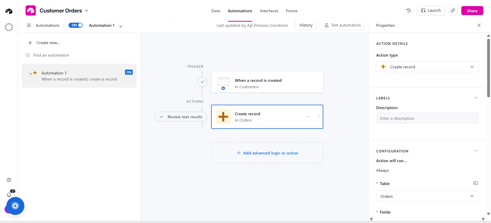
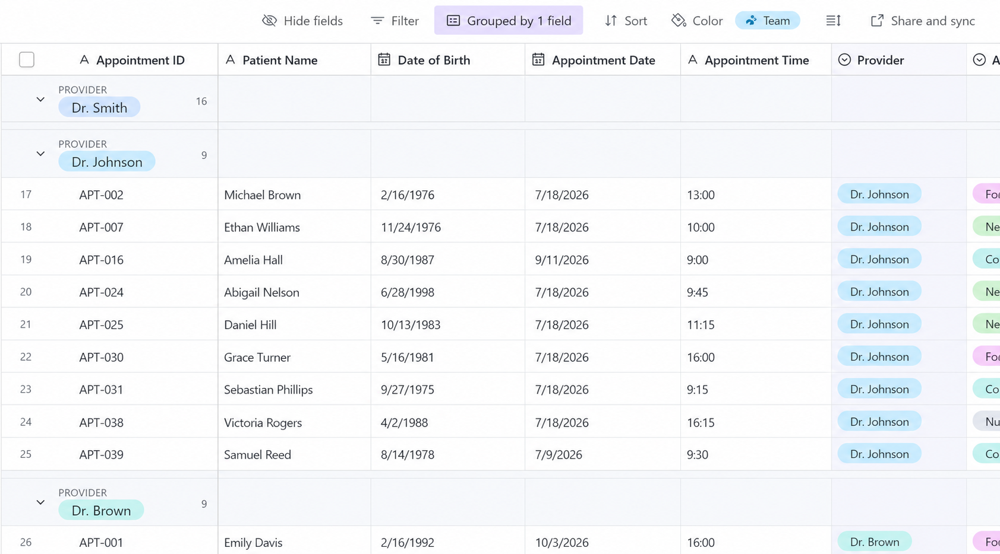
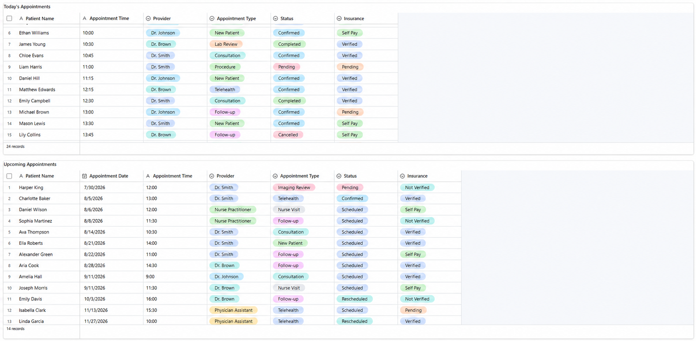
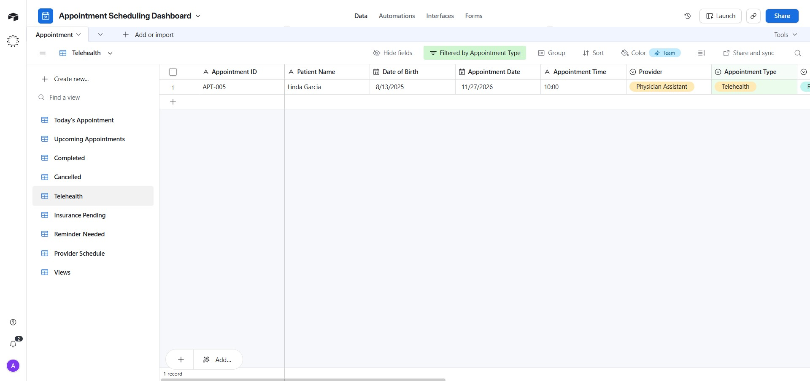
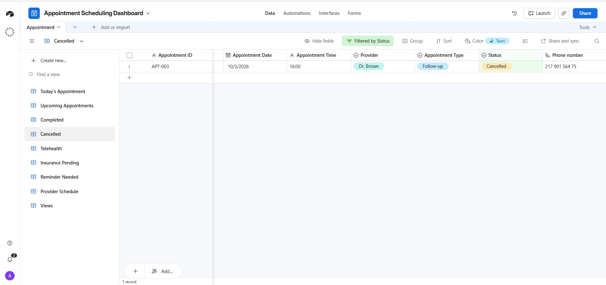
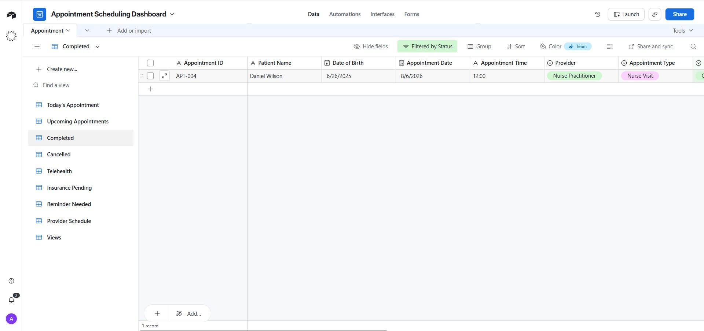
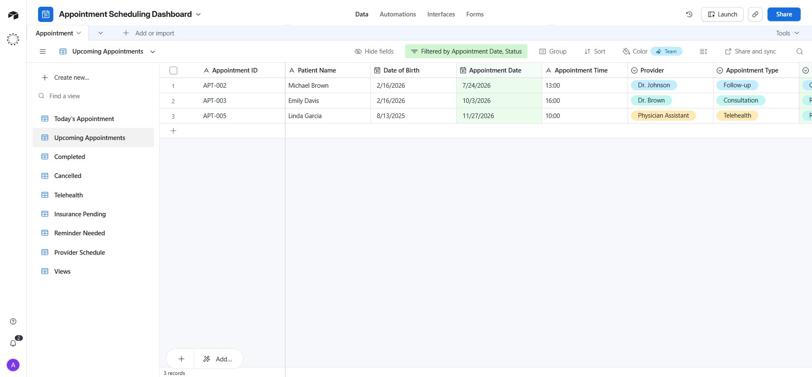

# Workflow Automation Portfolio

## Prepared by

**Goodness Ajii, RN**  
Certified Medical Virtual Assistant | Workflow Automation Specialist

---

## About This Portfolio

This repository contains practical workflow automation projects designed, built, tested, and documented using modern no-code and low-code automation platforms.

The projects demonstrate how automation can improve business operations by reducing repetitive tasks, improving data accuracy, accelerating communication, and creating more efficient workflows.

## Automation Tools Demonstrated

- Zapier
- n8n
- Airtable
- Google Workspace Automation
- AI Workflow Concepts
- Database Workflow Design

---

# Portfolio Overview

This collection includes real workflow builds covering:

- Healthcare operations automation
- Student enrollment workflows
- Customer management systems
- Database automation
- Appointment management systems
- Conditional workflow routing
- Business process improvement

Each project demonstrates:

✓ The operational challenge  
✓ Workflow logic and automation process  
✓ Tools and integrations used  
✓ Implementation evidence  
✓ Business impact  

---

# Featured Projects

---

# 01. Google Forms → Google Sheets → Gmail Confirmation Workflow

**Platform:** Zapier

## Overview

An automated intake confirmation workflow that captures form submissions, stores information in Google Sheets, and sends immediate confirmation emails.

## Workflow Process

1. User submits a Google Form
2. Response data is automatically recorded in Google Sheets
3. Gmail sends a confirmation message automatically

## Business Value

- Eliminates manual data entry
- Reduces response delays
- Improves customer communication

## Applicable Use Cases

- Patient intake
- Student registration
- Customer onboarding
- Appointment requests

---

# 02. Student Registration Conditional Routing Workflow

**Platform:** n8n

## Overview

A conditional automation workflow that evaluates student registration information and automatically routes applicants based on defined criteria.

## Workflow Process

1. Registration form submitted
2. Conditional logic evaluates information
3. Applicant is assigned to the appropriate program pathway

## Business Value

- Removes manual application sorting
- Speeds up enrollment processing
- Improves applicant management

## Applicable Use Cases

- Training programs
- Healthcare certification enrollment
- Lead qualification
- Customer segmentation

---

# 03. Airtable Customer Orders Automation

**Platform:** Airtable Automations

## Overview

A database automation system that creates connected records between customer information and order management tables.

## Workflow Process

1. New customer record created
2. Automation triggers
3. Related order record generated automatically

## Business Value

- Improves record management
- Reduces duplicate data entry
- Demonstrates relational database automation

## Applicable Use Cases

- CRM systems
- Order management
- Client databases
- Enrollment systems

---

# 04. Airtable Sales Tracker Database Architecture

**Platform:** Airtable

## Overview

A relational database system designed to manage products, pricing, categories, and linked sales information.

## Demonstrated Features

- Structured product database
- Linked records
- Organized information architecture
- Scalable database design

## Business Value

Demonstrates database structures applicable to:

- Inventory management
- CRM solutions
- Healthcare resource tracking
- Business operations

---

# 05. Airtable Sales Orders Database

**Platform:** Airtable

## Overview

A connected order management system linked with product records.

## Business Value

Shows practical relational database implementation beyond basic spreadsheets.

---

# 06. Healthcare Training Institute Student Inquiry Automation

**Platform:** Zapier

## Overview

An automated inquiry management workflow designed for a healthcare training organization.

## Workflow Process

1. Student submits inquiry form
2. Information is automatically captured
3. Tracking spreadsheet updates
4. Confirmation email is delivered

## Business Value

- Improves response speed
- Reduces administrative workload
- Ensures consistent communication

---

# 07. Automated Student Follow-Up Workflow

**Platform:** Zapier

## Overview

A follow-up automation system designed to reconnect with incomplete student applications.

## Workflow Process

1. New inquiry detected
2. Automation waits based on timing rules
3. Follow-up communication is sent automatically

## Business Value

- Prevents missed opportunities
- Improves enrollment conversion
- Reduces repetitive administrative work

---

# 08. Healthcare Appointment Management System

**Platform:** Airtable

## Overview

A centralized healthcare appointment management dashboard designed to improve scheduling visibility, patient coordination, and administrative workflow efficiency.

---

## Appointment Management Views

### Today's Appointments

### Practice Schedule

### Appointment Tables

### Reminder Needed

### Insurance Pending

### Telehealth Appointments

### Cancelled Appointments

### Completed Appointments

### Upcoming Appointments

---

## Automation Opportunities

Examples of workflows that can extend this system:

- Appointment reminder automation
- Patient confirmation tracking
- Insurance verification workflows
- Cancellation recovery workflows
- Patient communication automation

## Skills Demonstrated

- Healthcare workflow mapping
- Airtable database design
- Operational dashboard creation
- Process improvement
- Automation planning

---

# Automation Skills

## Workflow Automation

- Zapier automation design
- n8n workflow creation
- Trigger-based automation
- Conditional logic workflows
- Business process automation

## Database Management

- Airtable database architecture
- Relational database structures
- Linked records
- Data organization systems

## Healthcare Operations

- Appointment workflow management
- Patient communication systems
- Administrative process optimization
- Healthcare operations support

## Technical Concepts

- API concepts
- Webhooks
- No-code / low-code development
- AI workflow integration

---

# Tools Summary

| Tool | Capability |
|---|---|
| Zapier | Business automation workflows |
| n8n | Conditional workflow automation |
| Airtable | Database systems and dashboards |
| Google Workspace | Forms, Sheets, Gmail automation |
| AI Tools | Workflow enhancement concepts |

---

# Portfolio Philosophy

These projects focus on solving operational problems through automation.

The goal is not only creating workflows, but designing systems that help organizations:

- Save time
- Reduce repetitive tasks
- Improve accuracy
- Deliver better customer experiences
- Scale operations efficiently

---

# Contact

**Goodness Ajii, RN**

Certified Medical Virtual Assistant  
Workflow Automation Specialist

For automation projects, healthcare operations support, and workflow improvement:

Email: [Your Email]

LinkedIn: [Your LinkedIn]

---

## Verification

All workflows displayed in this portfolio were designed, configured, tested, and documented by Goodness Ajii.

Screenshots represent workflow configurations, database structures, dashboards, and automation environments created during development.
